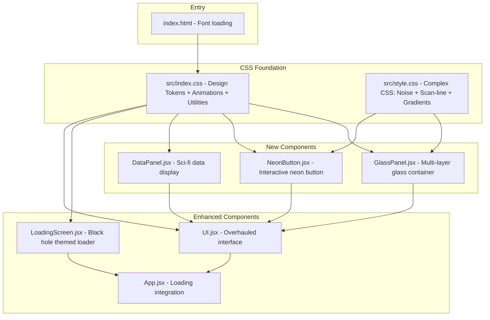

# Black Hole Observatory - UI/UX Design System and Implementation Plan

## 1. Current State Summary

| File | Status | Issues |
|------|--------|--------|
| `src/index.css` | Minimal | Only Tailwind import + basic resets. No design tokens, no animations, no custom properties |
| `src/style.css` | Unused | Leftover Vite template CSS. Not imported by the app |
| `src/components/UI.jsx` | Basic | Inline Tailwind glassmorphism, broken dynamic class names with JIT, no entrance animations |
| `src/components/LoadingScreen.jsx` | Functional | Basic concentric circles, simple progress bar, not integrated into App.jsx |
| `src/App.jsx` | Simple | No LoadingScreen integration, no transition states |
| `src/components/SoundToggle.jsx` | Audio only | Returns null visually; sound button is in UI.jsx |

## 2. Design Token System

### 2.1 Color Palette - CSS Custom Properties

```
--color-void:          #000005       /* Deepest background */
--color-abyss:         #0a0a1a       /* Panel backgrounds */
--color-deep:          #111128       /* Elevated surfaces */
--color-surface:       #1a1a3e       /* Card surfaces */
--color-elevated:      #252550       /* Hover/active surfaces */

--color-cyan:          #00ffff       /* Primary accent */
--color-cyan-dim:      #00cccc       /* Muted cyan */
--color-cyan-glow:     rgba(0,255,255,0.4)
--color-cyan-subtle:   rgba(0,255,255,0.08)

--color-purple:        #bf00ff       /* Secondary accent */
--color-purple-dim:    #9900cc       /* Muted purple */
--color-purple-glow:   rgba(191,0,255,0.4)
--color-purple-subtle: rgba(191,0,255,0.08)

--color-text-primary:  rgba(255,255,255,0.9)
--color-text-secondary:rgba(255,255,255,0.6)
--color-text-muted:    rgba(255,255,255,0.35)
--color-text-dim:      rgba(255,255,255,0.15)

--color-border:        rgba(255,255,255,0.08)
--color-border-hover:  rgba(255,255,255,0.15)
--color-border-cyan:   rgba(0,255,255,0.25)
--color-border-purple: rgba(191,0,255,0.25)
```

### 2.2 Glassmorphism Depth Levels

| Level | Background | Blur | Border | Use Case |
|-------|-----------|------|--------|----------|
| Surface | rgba(255,255,255,0.02) | 8px | rgba(255,255,255,0.06) | Background panels |
| Elevated | rgba(255,255,255,0.03) | 12px | rgba(255,255,255,0.08) | Cards, stat panels |
| Floating | rgba(255,255,255,0.05) | 16px | rgba(255,255,255,0.10) | Modals, popovers |
| Prominent | rgba(255,255,255,0.08) | 20px | rgba(255,255,255,0.12) | Hero elements |

### 2.3 Glow System

```
--glow-cyan-sm:   0 0 10px rgba(0,255,255,0.15)
--glow-cyan-md:   0 0 20px rgba(0,255,255,0.2), 0 0 40px rgba(0,255,255,0.1)
--glow-cyan-lg:   0 0 30px rgba(0,255,255,0.3), 0 0 60px rgba(0,255,255,0.15), 0 0 100px rgba(0,255,255,0.05)
--glow-purple-sm: 0 0 10px rgba(191,0,255,0.15)
--glow-purple-md: 0 0 20px rgba(191,0,255,0.2), 0 0 40px rgba(191,0,255,0.1)
--glow-purple-lg: 0 0 30px rgba(191,0,255,0.3), 0 0 60px rgba(191,0,255,0.15), 0 0 100px rgba(191,0,255,0.05)
```

### 2.4 Typography Scale

```
--font-sans:  Inter, system-ui, -apple-system, sans-serif
--font-mono:  JetBrains Mono, Fira Code, ui-monospace, monospace

--text-xs:    clamp(0.625rem, 0.6rem + 0.15vw, 0.75rem)
--text-sm:    clamp(0.7rem, 0.65rem + 0.2vw, 0.875rem)
--text-base:  clamp(0.8rem, 0.75rem + 0.25vw, 1rem)
--text-lg:    clamp(1rem, 0.9rem + 0.5vw, 1.5rem)
--text-xl:    clamp(1.25rem, 1rem + 1vw, 2.25rem)
--text-2xl:   clamp(1.5rem, 1rem + 2vw, 3.5rem)
```

### 2.5 Timing and Easing

```
--ease-out-expo: cubic-bezier(0.16, 1, 0.3, 1)
--ease-in-out:   cubic-bezier(0.4, 0, 0.2, 1)
--ease-spring:   cubic-bezier(0.34, 1.56, 0.64, 1)

--duration-fast:   150ms
--duration-normal: 300ms
--duration-slow:   500ms
--duration-slower: 800ms
--duration-crawl:  1200ms
```

## 3. Animation Keyframes

### 3.1 Entrance Animations
- fadeIn - opacity 0 to 1
- fadeInUp - opacity + translateY 20px to normal
- fadeInDown - opacity + translateY -20px to normal
- fadeInScale - opacity + scale 0.95 to normal
- slideInLeft / slideInRight - directional entrances

### 3.2 Looping Animations
- pulse-glow - subtle box-shadow pulse for neon elements
- breathe - slow scale oscillation for central elements
- scan-line - horizontal scan line moving vertically
- data-stream - vertical scrolling data effect
- orbit - circular rotation for loading elements

### 3.3 Interaction Animations
- ripple-expand - expanding circle from click point
- shimmer - gradient sweep across surface
- glow-pulse - brief intensity increase on hover
- press - scale down on active state

## 4. Component Architecture

### 4.1 GlassPanel Component

Reusable glassmorphism container with configurable depth, accent colors, glow, and hover effects.

**Props API:**
- `variant` - surface / elevated / floating / prominent - controls glassmorphism depth
- `accent` - none / cyan / purple - border accent color
- `glow` - none / sm / md / lg - glow intensity
- `hover` - boolean - enable hover lift and glow effects
- `animate` - none / fadeIn / fadeInUp / fadeInScale - entrance animation
- `noise` - boolean - add subtle noise texture overlay
- `edgeLight` - boolean - top edge highlight streak
- `delay` - number - animation delay in ms
- `className` - string - additional CSS classes
- `children` - ReactNode

**Features:**
- Multi-layer backdrop blur
- Inner glow on hover
- Edge lighting effect via pseudo-element
- Noise texture via SVG filter
- Staggered entrance animation delay

### 4.2 NeonButton Component

Interactive button with neon glow, ripple distortion, particle click effects, and gradient border animation.

**Props API:**
- `color` - cyan / purple / gradient - accent color
- `variant` - default / outline / ghost - visual style
- `size` - sm / md / lg - sizing
- `glow` - boolean - persistent glow effect
- `particles` - boolean - click particle burst
- `ripple` - boolean - click ripple distortion
- `shimmer` - boolean - hover shimmer sweep
- `loading` - boolean - show loading state
- `onClick` - function
- `disabled` - boolean
- `children` - ReactNode

**Visual States:**
- Default: glass background + neon border
- Hover: glow intensifies + shimmer sweep
- Active: scale down + ripple expand
- Focus: outline ring + glow
- Loading: pulsing dots animation
- Disabled: dimmed + no interactions

### 4.3 DataPanel Component

Sci-fi data display with label, value, status indicators, and monospace styling.

**Props API:**
- `label` - string - data label
- `value` - string - data value
- `unit` - string - optional unit suffix
- `status` - default / active / warning / critical - status indicator color
- `animate` - boolean - animate value changes
- `variant` - compact / default / detailed - display density
- `className` - string

**Visual Elements:**
- Status dot with pulse animation for active status
- Monospace value with subtle text-shadow glow
- Label in muted tracking-wider style
- Optional unit suffix
- Bottom border accent line

## 5. File-by-File Implementation Plan

### 5.1 src/index.css - Complete Overhaul

Add:
1. CSS custom properties for the entire design token system
2. SVG noise texture filter definition
3. Keyframe animations for entrance, looping, and interaction
4. Glassmorphism utility classes
5. Neon glow utility classes
6. Animation utility classes
7. Responsive typography using clamp
8. Custom scrollbar with glow effect
9. Selection styling with cyan highlight
10. Focus-visible ring styling for accessibility

Keep:
- Tailwind import directive
- Basic reset
- Full-height html/body/root setup
- Canvas display block

### 5.2 src/style.css - Replace Entirely

Replace leftover Vite template CSS with:
1. Noise texture overlay utility
2. Scan-line effect for data panels
3. Gradient border animation with rotating conic gradient
4. Custom range slider styling
5. Toggle switch component styles
6. Complex CSS that cannot be expressed as Tailwind utilities

### 5.3 src/components/GlassPanel.jsx - New Component

- Uses CSS custom properties for theming
- Renders a div with glassmorphism classes based on variant prop
- Optional edge lighting via inner span with absolute positioning
- Optional noise overlay via inner span with SVG filter reference
- Entrance animation via style attribute with animation-delay
- Hover effects via CSS classes with transitions
- forwardRef for flexibility

### 5.4 src/components/NeonButton.jsx - New Component

- Fixes broken dynamic Tailwind class issue from current RippleButton
- Uses explicit CSS classes instead of string interpolation
- Ripple effect: tracks click position, renders expanding circle
- Particle effect: on click, spawns 6-8 small spans that fly outward and fade
- Shimmer effect: inner div with gradient that translates on hover
- Glow effect: box-shadow transition on hover/active
- Loading state: replaces children with animated dots
- All animations use CSS transitions + keyframes for performance

### 5.5 src/components/DataPanel.jsx - New Component

- Compact sci-fi data display
- Status dot: small colored circle with pulse animation
- Value uses monospace font with subtle text-shadow glow
- Label uses muted color with wide letter-spacing
- Bottom accent line: thin gradient border
- animate prop triggers brief highlight flash when value changes

### 5.6 src/components/LoadingScreen.jsx - Enhancement

1. Black hole animation: concentric rings with different rotation speeds + central dark circle with event horizon glow
2. Enhanced progress bar: thicker bar with glow effect, gradient fill, and particle trail
3. Dramatic typography: larger text with letter-spacing animation
4. Smoother exit: fade out entire screen with scale-up effect before calling onComplete
5. Phase indicators: show loading phases with individual status dots
6. Accretion disk effect: rotating gradient ring around center

### 5.7 src/components/UI.jsx - Overhaul

1. Import and use GlassPanel, NeonButton, DataPanel components
2. Fix broken dynamic Tailwind classes
3. Add staggered entrance animations to all panels
4. Improve responsive layout:
   - Mobile: stack vertically, hide side stats, show compact bottom bar
   - Tablet: show side stats in horizontal row below center
   - Desktop: current layout with enhanced panels
5. Add hover effects to stat panels with subtle glow + border highlight
6. Enhance center title with breathing animation
7. Add scan-line effect to header panel
8. Improve scroll indicator with animation
9. Add subtle vignette overlay for cinematic feel

### 5.8 src/App.jsx - Loading Integration

1. Add loading state initialized to true
2. Render LoadingScreen conditionally
3. On onComplete, fade out loading screen then set loading to false
4. Wrap UI in a fadeIn animation that triggers after loading completes
5. Ensure Canvas starts rendering behind loading screen for seamless transition

### 5.9 index.html - Font Updates

1. Add JetBrains Mono font for data displays
2. Update Google Fonts link to include both Inter and JetBrains Mono with appropriate weights

## 6. Responsive Breakpoints

| Breakpoint | Width | Layout Changes |
|-----------|-------|----------------|
| Mobile | less than 640px | Single column, compact panels, bottom controls stack, side stats hidden |
| Tablet | 640-1024px | Two-column where needed, side stats in horizontal row |
| Desktop | 1024-1440px | Full layout with side stats panel |
| Wide | greater than 1440px | Extra padding, larger typography |

## 7. Performance Considerations

- All animations use transform and opacity only for GPU acceleration
- backdrop-filter blur limited to 20px max for mobile performance
- Noise texture uses a single SVG filter definition referenced by all instances
- Particle effects limited to 8 particles per click, auto-cleaned after animation
- will-change applied sparingly to animated elements
- Reduced motion media query respected

## 8. Accessibility

- Focus-visible rings on all interactive elements using cyan outline
- Minimum contrast ratio of 4.5:1 for text on dark backgrounds
- aria-label on icon-only buttons
- role=status on loading screen progress
- Keyboard navigation support for all controls
- Reduced motion support for vestibular disorders

## 9. Implementation Order

1. CSS foundation - index.css + style.css with design tokens, animations, utilities
2. New components - GlassPanel, NeonButton, DataPanel with no existing dependencies
3. Loading screen - Enhanced LoadingScreen.jsx as standalone component
4. App integration - App.jsx loading state + index.html fonts
5. UI overhaul - UI.jsx refactor to use new components
6. Documentation - Design system docs

## 10. Architecture Diagram


