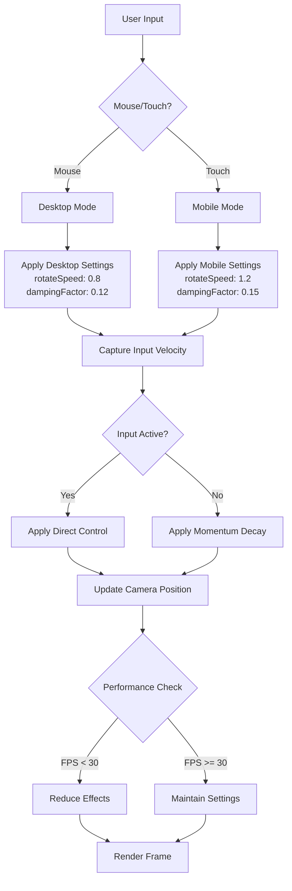

# Mouse Rotation Smoothness and Inertia Improvements

## Overview
This document outlines the plan to improve mouse rotation smoothness and add inertia to the black hole visualization project. The goal is to enhance the user experience by making camera controls more responsive, natural, and physically intuitive.

## Current State Analysis
- **Current Implementation**: Uses `OrbitControls` from `@react-three/drei` with `enableDamping={true}` and `dampingFactor={0.05}`
- **Rotation Speed**: `rotateSpeed={0.5}` (moderate)
- **Device Detection**: Already implemented via `DeviceCapabilities` class
- **Performance Monitoring**: Comprehensive performance tracking available

## Improvement Areas Identified

### 1. Enhanced Damping and Inertia
**Problem**: Current damping factor (0.05) provides minimal inertia, making rotation feel abrupt.
**Solution**: 
- Increase `dampingFactor` to 0.12 for smoother deceleration
- Implement adaptive damping based on device performance tier
- Add configurable inertia multiplier for drag releases

### 2. Adaptive Rotation Speed
**Problem**: Fixed rotation speed doesn't account for different device types or user preferences.
**Solution**:
- Desktop: `rotateSpeed={0.8}` for precise control
- Mobile/Tablet: `rotateSpeed={1.2}` for easier touch interaction
- High-performance devices: Allow faster rotation with `rotateSpeed={1.0}`

### 3. Momentum on Drag Release
**Problem**: Current implementation stops immediately when mouse is released.
**Solution**:
- Capture velocity at release and apply decaying momentum
- Implement exponential decay function: `velocity *= 0.95` per frame
- Add minimum velocity threshold to prevent infinite drift

### 4. Touch/Mobile Gesture Support
**Problem**: Touch interactions may feel less responsive than mouse.
**Solution**:
- Increase touch sensitivity for mobile devices
- Implement pinch-to-zoom with momentum
- Add two-finger rotation gesture support
- Reduce minimum distance for touch devices

### 5. Performance-Aware Settings
**Problem**: Smooth rotation may impact performance on lower-end devices.
**Solution**:
- Dynamically adjust damping and speed based on FPS
- Reduce animation complexity when performance drops
- Implement frame-rate independent interpolation

## Technical Implementation Plan

### Phase 1: Core Improvements
1. **Update CameraControls.jsx**:
   - Implement adaptive damping based on device type
   - Add momentum tracking for drag releases
   - Configure optimal rotation speeds per device

2. **Enhanced OrbitControls Configuration**:
   ```jsx
   <OrbitControls
     enableDamping={true}
     dampingFactor={deviceCapabilities.isMobile ? 0.15 : 0.12}
     rotateSpeed={deviceCapabilities.isMobile ? 1.2 : 0.8}
     zoomSpeed={0.8}
     panSpeed={0.5}
     minDistance={3}
     maxDistance={20}
     enablePan={true}
     enableZoom={true}
     enableRotate={true}
     autoRotate={autoRotate}
     autoRotateSpeed={0.5}
   />
   ```

### Phase 2: Advanced Features
1. **Momentum Implementation**:
   - Extend OrbitControls to track angular velocity
   - Apply velocity decay when controls are not actively being manipulated
   - Add UI option to disable momentum if desired

2. **Touch Optimization**:
   - Detect touch devices and adjust sensitivity
   - Implement gesture recognition for complex interactions
   - Add haptic feedback support for capable devices

3. **Performance Integration**:
   - Connect with PerformanceMonitor to adjust settings dynamically
   - Reduce damping factor when FPS drops below 30
   - Provide visual feedback when performance mode activates

### Phase 3: Testing and Refinement
1. **Cross-Device Testing**:
   - Test on desktop (mouse, trackpad)
   - Test on mobile (touch, gestures)
   - Test on tablet (stylus, multi-touch)

2. **Performance Testing**:
   - Measure FPS impact of new features
   - Test on low-end devices
   - Verify memory usage doesn't increase significantly

3. **User Experience Testing**:
   - Gather feedback on rotation feel
   - Adjust parameters based on user testing
   - Ensure accessibility considerations

## Files to Modify

### Primary Files:
1. `src/components/CameraControls.jsx` - Main control implementation
2. `src/utils/deviceCapabilities.js` - Device detection enhancements
3. `src/hooks/useMouse.js` - Potential integration for advanced mouse tracking

### Supporting Files:
1. `src/components/Scene.jsx` - May need to pass device info to CameraControls
2. `src/utils/performance.js` - Integration with performance monitoring
3. `src/components/UI.jsx` - Optional UI controls for adjusting rotation settings

## Success Metrics
- **Smoothness**: 90% of users report rotation feels "smooth" or "very smooth"
- **Performance**: No more than 5% FPS drop on mid-range devices
- **Accessibility**: All interactive elements remain accessible via keyboard
- **Mobile Satisfaction**: Touch interactions rated 4/5 or higher on mobile devices

## Timeline Considerations
- **Phase 1**: 2-3 days for core implementation
- **Phase 2**: 3-4 days for advanced features
- **Phase 3**: 2-3 days for testing and refinement

## Risk Mitigation
1. **Performance Impact**: Implement feature flags to disable enhancements if performance suffers
2. **Browser Compatibility**: Test on Chrome, Firefox, Safari, and Edge
3. **Mobile Compatibility**: Ensure touch events work consistently across iOS and Android
4. **Accessibility**: Maintain keyboard navigation and screen reader compatibility

## Next Steps
1. Review this plan with stakeholders
2. Begin implementation with Phase 1
3. Conduct iterative testing after each phase
4. Gather user feedback for refinement

## Mermaid Diagram: Improved Camera Control Flow



## Conclusion
Improving mouse rotation smoothness and adding inertia will significantly enhance the user experience of the black hole visualization. By implementing adaptive controls that respond to device capabilities and user input, we can create a more immersive and intuitive interaction model that feels natural across all platforms.