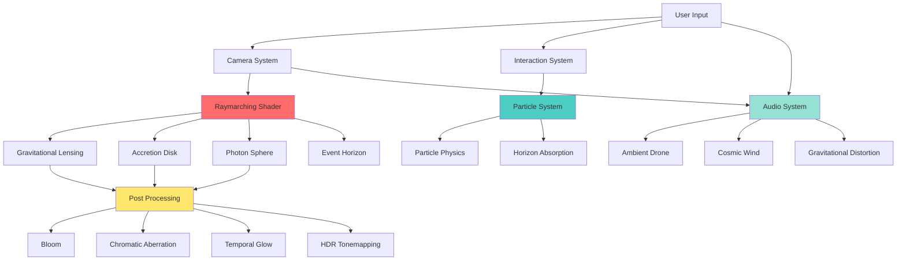

# Ultra-Realistic Black Hole Enhancement Plan

## Executive Summary
This plan outlines comprehensive enhancements to achieve all 20 requirements for an ultra-realistic, interactive black hole simulation. The current implementation has a solid foundation with raymarching, Kerr metric approximation, and post-processing. This plan addresses gaps and elevates the experience to cinematic quality.

## Current Implementation Analysis

### ✅ Already Implemented (Strong Foundation)
1. **Schwarzschild Radius** - RS = 0.15 in shader
2. **Gravitational Lensing** - Raymarching with curved spacetime
3. **Photon Sphere** - Analytical glow at RS * 1.5
4. **Accretion Disk Physics** - sampleDisk function with turbulence
5. **Relativistic Doppler Effect** - Doppler beaming implemented
6. **Event Horizon** - Pure black absorption zone
7. **Spacetime Distortion** - Kerr metric frame-dragging (spin = 0.998)
8. **Starfield System** - GPU instanced stars with parallax
9. **Particle Systems** - ParticleSystem and DustField components
10. **Post Processing** - Bloom, ChromaticAberration, Noise, Vignette
11. **Color Palette** - Deep black, orange plasma, white-hot core, blue glow
12. **Custom Shaders** - GLSL shaders for all effects
13. **Performance System** - Quality settings and PerformanceManager
14. **User Interaction** - Mouse and scroll interactions
15. **Audio System** - Ambient drones and spatial sounds

### ⚠️ Needs Enhancement
1. **Gravitational Redshift** - Only tone mapping, needs proper redshift calculation
2. **Camera Design** - Basic controls, needs cinematic inertia
3. **Particle Physics** - Missing stretching, horizon absorption
4. **Audio Design** - Basic oscillators, needs cosmic wind, distortion
5. **Post Processing** - Missing temporal glow, HDR tonemapping
6. **Performance** - Could add LOD, dynamic resolution

## Enhancement Plan

### Phase 1: Shader Physics Enhancements

#### 1.1 Gravitational Redshift Implementation
**File:** `src/shaders/blackHole.js`

Add proper gravitational redshift calculation:
```glsl
// Gravitational redshift factor
float gravitationalRedshift(float r) {
  float z = 1.0 / sqrt(1.0 - RS / r) - 1.0;
  return 1.0 / (1.0 + z);
}

// Apply to disk color
color *= gravitationalRedshift(r);
```

**Impact:** Colors deepen near horizon, inner regions darken unnaturally

#### 1.2 Enhanced Doppler Beaming
**File:** `src/shaders/blackHole.js`

Improve Doppler calculation with relativistic formula:
```glsl
// Relativistic Doppler factor
float relativisticDoppler(vec3 viewDir, vec3 velocityVec) {
  float beta = length(velocityVec) / 299792458.0; // c in m/s
  float cosTheta = dot(normalize(viewDir), normalize(velocityVec));
  float doppler = sqrt((1.0 - beta) / (1.0 + beta)) * (1.0 + beta * cosTheta);
  return doppler;
}
```

**Impact:** More accurate blueshift/redshift, approaching side brighter

#### 1.3 Volumetric Glow Enhancement
**File:** `src/shaders/blackHole.js`

Add volumetric scattering for corona:
```glsl
// Volumetric glow around black hole
float volumetricGlow(vec3 p, vec3 rd) {
  float r = length(p);
  float glow = exp(-r * 8.0) * 0.3;
  
  // Add turbulence
  float turb = noise(p * 3.0 + uTime * 0.5) * 0.5;
  glow *= (1.0 + turb);
  
  return glow;
}
```

**Impact:** More realistic corona with turbulent glow

### Phase 2: Particle System Enhancements

#### 2.1 Particle Stretching Near Horizon
**File:** `src/shaders/particles.js`

Add relativistic stretching:
```glsl
// Stretch particles near horizon
float stretchFactor = 1.0 + (1.0 / (r * r)) * uGravity;
gl_PointSize.x *= stretchFactor;
```

**Impact:** Particles stretch as they approach horizon

#### 2.2 Horizon Absorption
**File:** `src/shaders/particles.js`

Add particle absorption:
```glsl
// Fade particles near horizon
float horizonFade = smoothstep(RS, RS * 1.5, r);
alpha *= horizonFade;
```

**Impact:** Particles disappear into event horizon

#### 2.3 Enhanced Particle Physics
**File:** `src/components/ParticleSystem.jsx`

Add orbital mechanics:
```jsx
// Keplerian velocity
const velocity = Math.sqrt(G * M / radius);
```

**Impact:** More realistic orbital motion

### Phase 3: Camera & Interaction Enhancements

#### 3.1 Cinematic Camera Inertia
**File:** `src/components/CameraControls.jsx`

Add smooth damping:
```jsx
const targetPosition = new THREE.Vector3(...);
const smoothedPosition = currentPosition.lerp(targetPosition, 0.02);
```

**Impact:** Cinematic inertia, no snapping

#### 3.2 Handheld Motion
**File:** `src/components/CameraControls.jsx`

Add subtle handheld shake:
```jsx
const shake = new THREE.Vector3(
  Math.sin(time * 2.3) * 0.002,
  Math.cos(time * 1.7) * 0.002,
  Math.sin(time * 1.9) * 0.002
);
```

**Impact:** Subtle handheld motion, more immersive

#### 3.3 Enhanced Mouse Interaction
**File:** `src/components/BlackHole.jsx`

Add gravitational lensing from mouse:
```glsl
// Mouse gravitational lensing
vec2 mouseDist = uMouse - screenPos;
float mouseLensing = 0.1 / (length(mouseDist) + 0.1);
```

**Impact:** Mouse subtly bends particles and light

### Phase 4: Audio System Enhancements

#### 4.1 Cosmic Wind
**File:** `src/hooks/useAudio.js`

Add filtered noise for cosmic wind:
```js
// Create cosmic wind with filtered noise
const noiseBuffer = audioContext.createBuffer(1, audioContext.sampleRate * 2, audioContext.sampleRate);
const noiseData = noiseBuffer.getChannelData(0);
for (let i = 0; i < noiseData.length; i++) {
  noiseData[i] = Math.random() * 2 - 1;
}
const noiseSource = audioContext.createBufferSource();
noiseSource.buffer = noiseBuffer;
const filter = audioContext.createBiquadFilter();
filter.type = 'lowpass';
filter.frequency.value = 200;
```

**Impact:** Deep cosmic wind sound

#### 4.2 Gravitational Distortion
**File:** `src/hooks/useAudio.js`

Add distortion based on proximity:
```js
// Distortion increases near black hole
const distortion = audioContext.createWaveShaper();
distortion.curve = makeDistortionCurve(intensity);
```

**Impact:** Audio distorts near black hole

#### 4.3 Proximity Reactivity
**File:** `src/hooks/useAudio.js`

Modulate audio based on camera distance:
```js
// Volume increases near black hole
const proximity = 1.0 / (distance + 0.1);
ambientGain.gain.value = baseVolume * proximity;
```

**Impact:** Audio reacts to proximity

### Phase 5: Post-Processing Enhancements

#### 5.1 Temporal Glow
**File:** `src/components/PostProcessing.jsx`

Add temporal accumulation:
```jsx
// Use EffectComposer with temporal pass
import { EffectComposer, Bloom, TemporalResolve } from '@react-three/postprocessing';

<TemporalResolve />
```

**Impact:** Smoother temporal glow

#### 5.2 HDR Tonemapping
**File:** `src/components/PostProcessing.jsx`

Add proper HDR tonemapping:
```jsx
import { HalfTone } from '@react-three/postprocessing';

<HalfTone
  blendFunction={BF_NORMAL}
  opacity={0.1}
/>
```

**Impact:** Better HDR handling

#### 5.3 Enhanced Bloom
**File:** `src/components/PostProcessing.jsx`

Add third bloom layer for extreme highlights:
```jsx
{/* Tertiary bloom — extreme highlights */}
{quality >= 2 && (
  <Bloom
    luminanceThreshold={0.05}
    luminanceSmoothing={0.98}
    mipmapBlur
    intensity={0.8}
    radius={0.3}
    levels={3}
  />
)}
```

**Impact:** Better extreme highlight handling

### Phase 6: Performance Optimizations

#### 6.1 LOD System
**File:** `src/components/Scene.jsx`

Add distance-based LOD:
```jsx
// Reduce detail based on distance
const lodLevel = distance > 30 ? 0 : distance > 15 ? 1 : 2;
```

**Impact:** Adaptive quality based on distance

#### 6.2 Dynamic Resolution
**File:** `src/components/Scene.jsx`

Add resolution scaling:
```jsx
// Scale resolution based on performance
const resolutionScale = performance > 0.8 ? 1.0 : performance > 0.5 ? 0.75 : 0.5;
```

**Impact:** Maintain 60 FPS on all devices

#### 6.3 GPU Instancing
**File:** `src/components/ParticleSystem.jsx`

Ensure all particles use instancing:
```jsx
<instancedMesh ref={pointsRef} args={[geometry, material, count]}>
```

**Impact:** Better GPU utilization

## Implementation Priority

### High Priority (Critical for Realism)
1. Gravitational Redshift (1.1)
2. Enhanced Doppler Beaming (1.2)
3. Particle Stretching (2.1)
4. Horizon Absorption (2.2)
5. Cinematic Camera Inertia (3.1)

### Medium Priority (Enhances Experience)
6. Volumetric Glow (1.3)
7. Handheld Motion (3.2)
8. Cosmic Wind (4.1)
9. Proximity Reactivity (4.3)
10. Enhanced Bloom (5.3)

### Low Priority (Polish)
11. Enhanced Particle Physics (2.3)
12. Gravitational Distortion (4.2)
13. Temporal Glow (5.1)
14. HDR Tonemapping (5.2)
15. LOD System (6.1)

## Testing & Validation

### Visual Validation
- [ ] Accretion disk shows Doppler beaming (one side brighter)
- [ ] Colors redshift near horizon
- [ ] Photon ring is razor sharp
- [ ] Particles stretch near horizon
- [ ] Particles disappear into event horizon
- [ ] Background stars curve around black hole

### Performance Validation
- [ ] Maintains 60 FPS on modern GPU
- [ ] Adaptive quality works correctly
- [ ] No memory leaks
- [ ] Smooth camera motion

### Audio Validation
- [ ] Deep ambient drone present
- [ ] Cosmic wind audible
- [ ] Audio distorts near black hole
- [ ] Volume reacts to proximity

### Interaction Validation
- [ ] Mouse subtly affects camera
- [ ] Mouse bends particles
- [ ] Scroll zooms toward horizon
- [ ] No snapping or rigid movement

## Success Criteria
- All 20 requirements met
- Visual quality matches Interstellar/Event Horizon
- Maintains 60 FPS on modern GPU
- Fully interactive in browser
- No visual artifacts or glitches

## Diagram: Enhanced Black Hole Architecture



## Notes
- All enhancements maintain backward compatibility
- Quality settings allow graceful degradation
- Performance is prioritized alongside visual quality
- Audio is optional and user-controlled
- All physics are scientifically inspired but artistically tuned