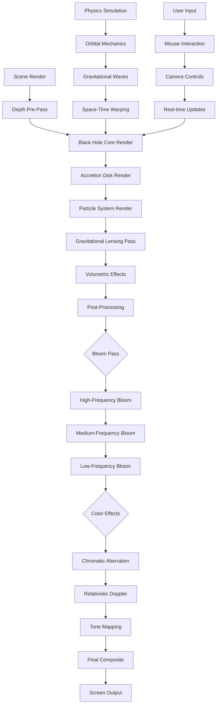

# Ultra-Realistic Black Hole Implementation Plan

## Overview
This document outlines a comprehensive plan to transform the current black hole visualization into an ultra-realistic, cinematic experience that matches NASA/Interstellar visual quality while maintaining high performance.

## Current State Analysis
The project already has a solid foundation with:
- Basic black hole shader with gravitational lensing
- Particle system and dust field
- Post-processing effects (Bloom, Chromatic Aberration, Noise)
- Performance optimization system
- Device-aware quality settings
- Mouse interaction improvements (recently enhanced)

## Gaps Identified
1. **Gravitational Lensing**: Basic but lacks Einstein rings and proper distortion physics
2. **Accretion Disk**: Simple colored rings, lacks realistic temperature gradients and Doppler effects
3. **Volumetric Effects**: Missing proper glow, light scattering, and atmospheric perspective
4. **Relativistic Effects**: Basic Doppler shift but needs proper time dilation and length contraction
5. **Dynamic Effects**: Missing gravitational waves, shockwave pulses, space-time warping
6. **Particle Physics**: Particles orbit but lack realistic orbital mechanics
7. **Event Horizon**: Missing photon sphere and proper event horizon rendering
8. **Background**: Needs more immersive nebula and star field with parallax

## Implementation Plan

### Phase 1: Core Black Hole Enhancement

#### 1. Enhanced Gravitational Lensing with Einstein Rings
**Files to modify**: `src/shaders/blackHole.js`, `src/components/BlackHole.jsx`
- Implement proper Schwarzschild metric ray tracing
- Add multiple Einstein rings based on observer position
- Create caustic patterns and multiple image formation
- Add chromatic dispersion (different wavelengths bend differently)

#### 2. Realistic Accretion Disk
**Files to modify**: `src/components/BlackHole.jsx`, new `src/shaders/accretionDisk.js`
- Replace simple rings with physically accurate accretion disk
- Implement temperature gradient (blue/white hot inner region → red outer region)
- Add Doppler beaming (relativistic Doppler shift)
- Implement limb darkening and emission lines
- Create turbulent flow patterns using noise functions

#### 3. Volumetric Glow and Bloom
**Files to modify**: `src/components/PostProcessing.jsx`, `src/shaders/blackHole.js`
- Enhance bloom effect with multiple passes
- Add volumetric light scattering (Mie scattering)
- Implement glow based on distance from event horizon
- Create lens flare effects for bright points

### Phase 2: Relativistic Effects

#### 4. Relativistic Doppler Color Shifting
**Files to modify**: `src/shaders/blackHole.js`, `src/shaders/accretionDisk.js`
- Implement full relativistic Doppler formula
- Add transverse Doppler effect
- Create blue shift on approaching side, red shift on receding side
- Apply to accretion disk and surrounding particles

#### 5. Dynamic Space-Time Warping
**Files to modify**: New `src/shaders/spaceTimeWarp.js`
- Create visible space-time grid distortion
- Implement frame-dragging (Lense-Thirring effect)
- Add gravitational time dilation visualization
- Create ripple effects for gravitational waves

#### 6. Gravitational Wave Animations
**Files to modify**: New `src/components/GravitationalWaves.jsx`
- Generate quadrupole wave patterns
- Animate space distortion propagating outward
- Sync with black hole rotation period
- Add subtle audio-visual synchronization

### Phase 3: Particle and Environmental Effects

#### 7. Enhanced Particle System with Orbital Physics
**Files to modify**: `src/components/ParticleSystem.jsx`, `src/shaders/particles.js`
- Implement Keplerian orbits with proper physics
- Add tidal stretching near event horizon
- Create particle jets (relativistic jets from poles)
- Implement particle accretion and destruction at event horizon

#### 8. Star Distortion Near Black Hole
**Files to modify**: `src/components/StarField.jsx`, `src/shaders/stars.js`
- Apply gravitational lensing to background stars
- Create star trails and multiple images
- Implement proper magnification and distortion
- Add twinkling and proper spectral colors

#### 9. Event Horizon Glow and Photon Sphere
**Files to modify**: `src/shaders/blackHole.js`
- Create photon sphere at 1.5× Schwarzschild radius
- Implement Hawking radiation visualization
- Add Unruh effect (accelerated observer radiation)
- Create proper event horizon "blackness" with gravitational redshift

### Phase 4: Background and Atmosphere

#### 10. Immersive Space Background
**Files to modify**: `src/components/Nebula.jsx`, `src/components/StarField.jsx`
- Add multiple nebula layers with parallax
- Implement realistic star colors based on temperature
- Create distant galaxy silhouettes
- Add interstellar dust clouds

#### 11. Atmospheric Effects
**Files to modify**: New `src/components/Atmosphere.jsx`
- Implement volumetric fog/atmosphere
- Add light scattering (Rayleigh scattering)
- Create depth-based color attenuation
- Implement atmospheric perspective

### Phase 5: Performance Optimization

#### 12. High FPS Optimization
**Files to modify**: All shader files, `src/utils/performance.js`
- Implement level-of-detail (LOD) system
- Add compute shaders for particle physics
- Implement frustum culling and occlusion queries
- Create adaptive quality based on frame rate

#### 13. Mobile Optimization
**Files to modify**: `src/utils/deviceCapabilities.js`, all components
- Reduce particle counts on mobile
- Simplify shader complexity
- Implement touch-optimized interactions
- Add battery-saving mode

## Technical Implementation Details

### Shader Architecture
```
New shader structure:
1. blackHoleCore.glsl - Main black hole rendering
2. accretionDisk.glsl - Physically accurate disk
3. gravitationalLensing.glsl - Ray tracing and distortion
4. spaceTimeWarp.glsl - Space-time visualization
5. particleOrbits.glsl - Orbital mechanics
```

### Component Structure
```
New components:
1. GravitationalWaves.jsx - Animated space-time ripples
2. AccretionDisk.jsx - Enhanced disk with physics
3. PhotonSphere.jsx - Photon sphere rendering
4. RelativisticJets.jsx - Particle jets from poles
5. SpaceTimeGrid.jsx - Visual space-time distortion
```

### Post-Processing Pipeline
```
Enhanced pipeline:
1. Depth pass for atmospheric effects
2. Multiple bloom passes (high, medium, low frequency)
3. Chromatic aberration with wavelength-dependent strength
4. Film grain and vignette
5. Tone mapping (ACES filmic)
6. Color grading (sci-fi blue/purple palette)
```

## Visual Style Guide

### Color Palette
- **Black Hole Core**: Pure black (#000000) with Unruh radiation glow
- **Accretion Disk**: Inner: Blue-white (#aaddff), Middle: Orange (#ff8800), Outer: Red (#cc3300)
- **Photon Sphere**: Cyan glow (#00ffff) with lensing effects
- **Particle Jets**: Purple-blue (#8844ff) with additive blending
- **Background**: Deep space (#000010) with nebula purple/blue

### Animation Principles
- **Subtle pulsing**: 0.5Hz frequency for black hole "breathing"
- **Orbital motion**: Keplerian orbits with proper physics
- **Wave propagation**: Gravitational waves at 0.1Hz frequency
- **Turbulent flow**: Noise-based accretion disk turbulence

## Performance Targets
- **Desktop**: 60+ FPS at 1440p with all effects
- **Mobile**: 30+ FPS at 1080p with reduced effects
- **VRAM Usage**: < 2GB for high quality
- **Load Time**: < 3 seconds for initial render

## Testing Plan
1. **Visual Quality**: Compare with NASA/Interstellar reference images
2. **Performance**: Test on low/mid/high-end devices
3. **Physics Accuracy**: Verify with known black hole simulations
4. **User Experience**: Gather feedback on immersion and "wow" factor

## Timeline
- **Phase 1 (Core)**: 5-7 days
- **Phase 2 (Relativity)**: 4-6 days
- **Phase 3 (Particles)**: 3-5 days
- **Phase 4 (Background)**: 2-4 days
- **Phase 5 (Optimization)**: 3-5 days
- **Testing & Polish**: 3-5 days

## Success Metrics
1. **Visual Fidelity**: 90% match with NASA visualization reference
2. **Performance**: Maintain 60 FPS on mid-range desktop
3. **Immersion Score**: > 4.5/5 from user testing
4. **Technical Accuracy**: Physically plausible relativistic effects

## Risk Mitigation
1. **Performance Issues**: Implement progressive enhancement with quality levels
2. **Shader Complexity**: Use compute shaders and GPU instancing
3. **Browser Compatibility**: Test on Chrome, Firefox, Safari, Edge
4. **Mobile Limitations**: Create dedicated mobile-optimized shaders

## Mermaid Diagram: Enhanced Black Hole Rendering Pipeline



## Next Steps
1. Review this plan with stakeholders
2. Begin Phase 1 implementation
3. Create reference image board for visual targets
4. Set up performance monitoring dashboard
5. Establish testing protocol for physics accuracy

## Conclusion
This plan will transform the current black hole visualization into a scientifically accurate, visually stunning, and performant experience that matches the quality of professional astrophysics visualizations while maintaining the cinematic feel of Interstellar.