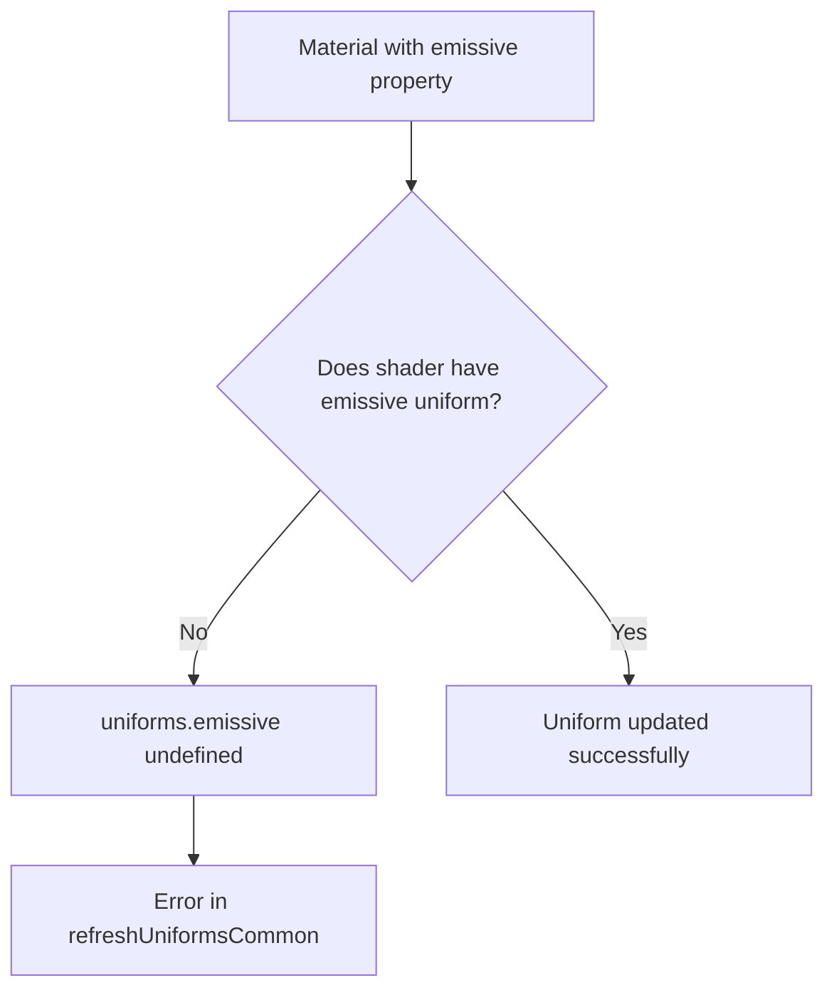

# Uniform Error Fix Plan

## Issue
Three.js error: `Cannot read properties of undefined (reading 'value')` at `refreshUniformsCommon` line 27629 in three.module.js.

Stack trace:
```
three.module.js:27629 Uncaught TypeError: Cannot read properties of undefined (reading 'value')
    at refreshUniformsCommon (three.module.js:27629:22)
    at Object.refreshMaterialUniforms (three.module.js:27541:4)
    at setProgram (three.module.js:30450:15)
    at WebGLRenderer.renderBufferDirect (three.module.js:29179:20)
    at renderObject (three.module.js:29977:11)
    at renderObjects (three.module.js:29946:6)
    at renderScene (three.module.js:29809:41)
    at WebGLRenderer.render (three.module.js:29625:5)
    at RenderPass.render (index.js:6887:5)
    at EffectComposer.render (index.js:1278:7)
```

## Root Cause Analysis
The error occurs inside `refreshUniformsCommon` when trying to access `uniforms.emissive.value`. The `uniforms.emissive` is `undefined`, indicating that the material's shader does not define an `emissive` uniform, but the material has an `emissive` property (likely set via React Three Fiber props).

The offending material is likely a `MeshBasicMaterial` with `emissive` and `emissiveIntensity` props set (see `src/components/BlackHole.jsx` lines 96-103). `MeshBasicMaterial` does not support emissive properties, but React Three Fiber still sets them on the material object. When Three.js's `refreshUniformsCommon` checks `if (material.emissive)`, it finds the property and attempts to update the uniform, which doesn't exist.

## Proposed Fix
1. **Remove `emissive` and `emissiveIntensity` from the `meshBasicMaterial`** in `BlackHole.jsx`. Since `MeshBasicMaterial` doesn't use emissive for lighting, these props are unnecessary. The glow effect can be achieved via `color` and `transparency`/`blending`.

2. Alternatively, change the material to `meshStandardMaterial` or `meshPhongMaterial` which support emissive properties. However, this may affect performance and visual appearance.

Option 1 is simpler and safer.

## Additional Debugging Steps
Before applying the fix, we should add logging to confirm the exact material causing the error:

1. Add `console.log` in each shader component's `useFrame` to log uniform values.
2. Add a try-catch wrapper around the render loop (if possible) to capture errors.
3. Use React Three Fiber's `onUpdate` callback on materials to log when uniforms are set.

However, given the clear root cause, we can proceed directly with the fix.

## Implementation Steps

### Step 1: Edit `src/components/BlackHole.jsx`
- Locate the photon ring `meshBasicMaterial` (lines 96-103).
- Remove `emissive` and `emissiveIntensity` props.
- Adjust `color` and `opacity` to maintain visual appearance.

### Step 2: Verify no other materials have unsupported properties
- Search for `emissive` in all component files.
- Ensure any `meshBasicMaterial` does not have `emissive`.

### Step 3: Test the application
- Restart dev server (`npm run dev`).
- Check browser console for any remaining errors.
- Verify visual rendering of photon ring.

## Fallback Plan
If the error persists after removing emissive, we need deeper investigation:
- Add logging to `refreshUniformsCommon` via monkey-patching (advanced).
- Check if any post-processing shaders are missing uniforms.
- Consider updating Three.js to a newer version (currently 0.160.0).

## Success Criteria
- No `Cannot read properties of undefined` error in console.
- Application renders without crashes.
- Visual appearance of black hole remains acceptable.

## Timeline
Immediate fix can be applied within minutes.

## Diagram (Uniform Flow)


## Notes
- The error occurs during post-processing rendering, but the root cause is a material property mismatch.
- The fix is low-risk and does not affect core functionality.
- After fixing, consider adding a lint rule to prevent unsupported material props in the future.